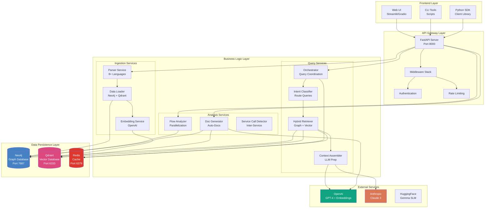
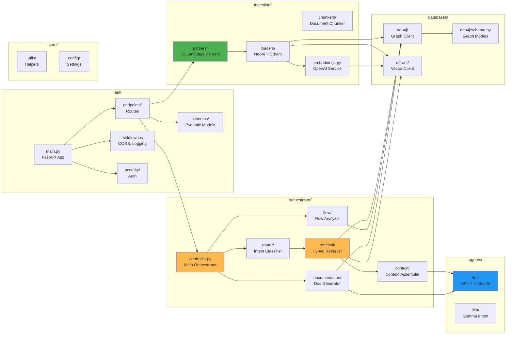
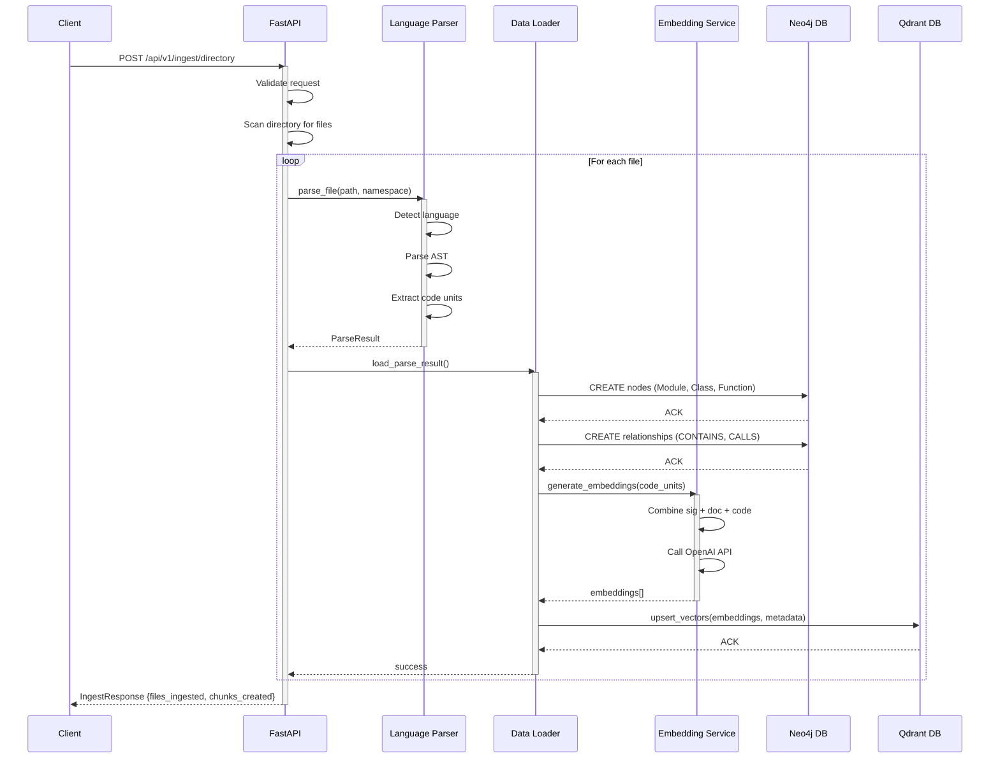
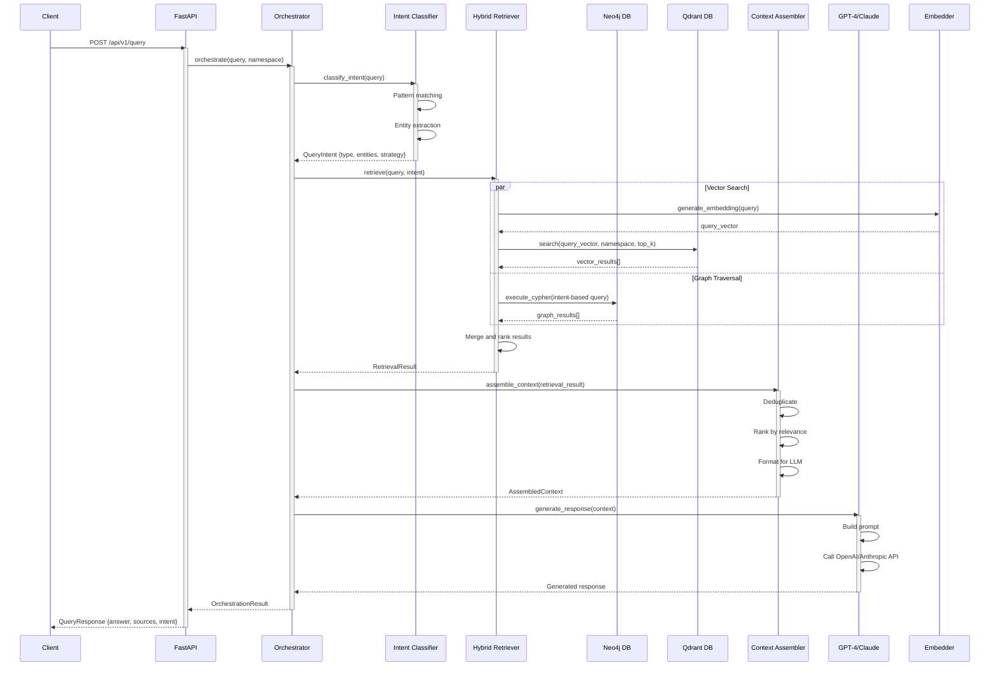
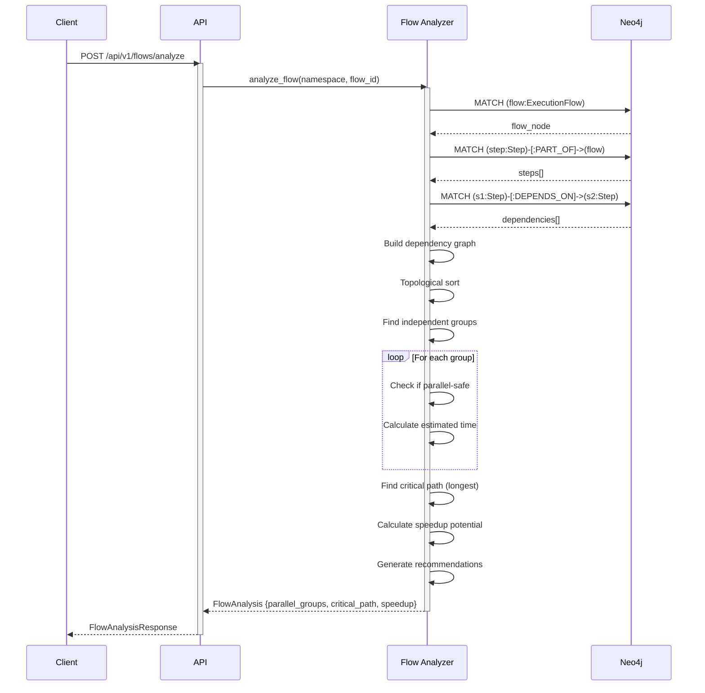
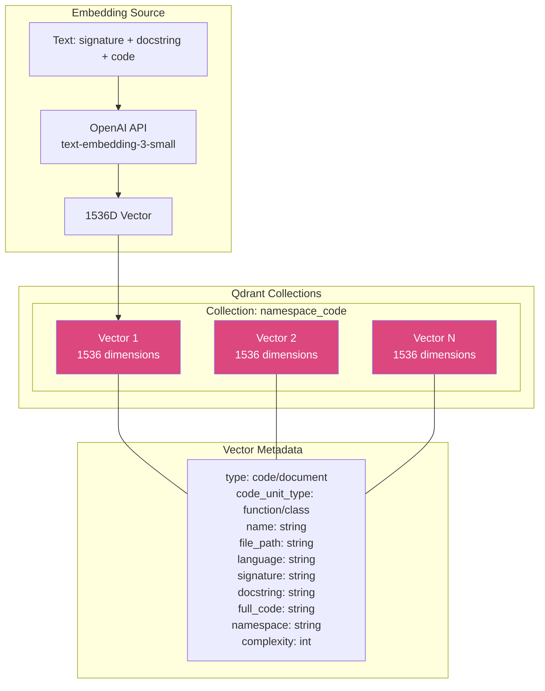
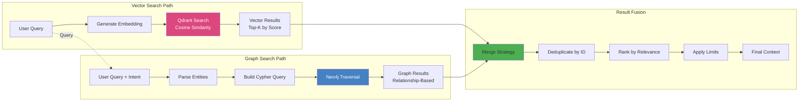
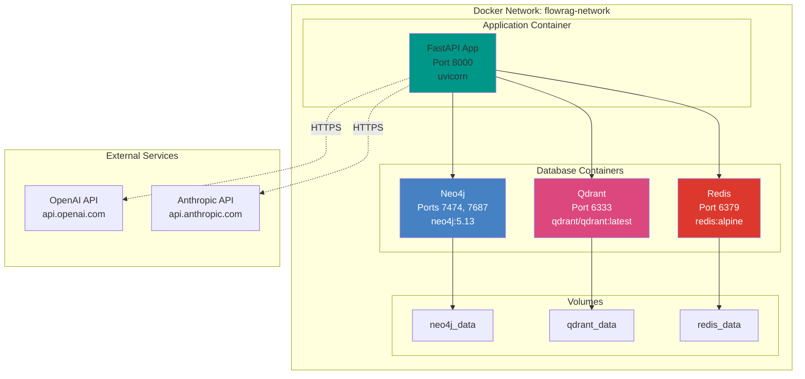
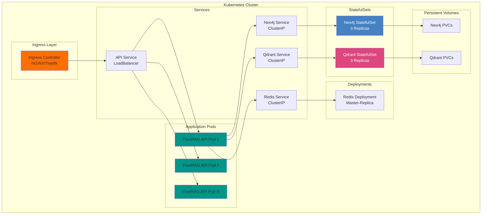

# FlowRAG Architecture Overview

## Table of Contents
- [Introduction](#introduction)
- [High-Level Architecture](#high-level-architecture)
- [Component Architecture](#component-architecture)
- [Data Flow Architecture](#data-flow-architecture)
- [Database Architecture](#database-architecture)
- [Query Pipeline Architecture](#query-pipeline-architecture)
- [Deployment Architecture](#deployment-architecture)

---

## Introduction

FlowRAG follows a **multi-agent microservice architecture** where each component has a specific responsibility. The system is designed for:
- **Scalability**: Handle codebases from small projects to enterprise-scale
- **Extensibility**: Easy to add new language parsers and LLM providers
- **Performance**: Optimized hybrid retrieval combining graph + vector search
- **Reliability**: Production-ready with comprehensive testing

---

## High-Level Architecture

### System Overview



### Architecture Layers

| Layer | Components | Responsibility |
|-------|-----------|----------------|
| **Frontend** | Web UI, CLI, SDK | User interaction |
| **API Gateway** | FastAPI, Middleware, Auth | Request routing, security |
| **Business Logic** | Ingestion, Query, Analysis | Core functionality |
| **Data Persistence** | Neo4j, Qdrant, Redis | Data storage and caching |
| **External Services** | OpenAI, Anthropic, HF | LLM and embedding providers |

---

## Component Architecture

### Component Dependency Diagram



### Module Responsibilities

#### **api/** - API Layer
- **main.py**: FastAPI application setup, CORS, middleware
- **endpoints/**: REST API route handlers
  - `ingest.py`: File/directory ingestion endpoints
  - `query.py`: Query endpoints (streaming + non-streaming)
  - `flow.py`: Flow analysis endpoints
  - `documentation.py`: Documentation generation endpoints
  - `workflows.py`: Multi-step workflow endpoints
- **schemas/**: Pydantic request/response models
- **middleware/**: Logging, error handling, CORS
- **security/**: API key authentication, rate limiting

#### **orchestrator/** - Query Coordination
- **controller.py**: Main orchestration logic
- **router/intent_classifier.py**: Query intent detection
- **retrieval/hybrid_retriever.py**: Graph + vector search
- **context/context_assembler.py**: LLM context preparation
- **flow/flow_analyzer.py**: Execution flow optimization
- **documentation/generator.py**: Auto-documentation

#### **ingestion/** - Code Processing
- **parsers/**: Language-specific AST parsers (15 languages)
- **chunkers/**: Document chunking with overlap
- **loaders/**: Database loaders (Neo4j, Qdrant)
- **embeddings.py**: OpenAI embedding generation

#### **databases/** - Data Access
- **neo4j/client.py**: Graph database operations
- **neo4j/schema.py**: Node and relationship models
- **neo4j/queries.py**: Pre-built Cypher queries
- **qdrant/client.py**: Vector database operations

#### **agents/** - LLM Integration
- **llm/response_generator.py**: GPT-4/Claude response generation
- **llm/llm_client.py**: Multi-provider abstraction
- **slm/intent_classifier_slm.py**: Gemma 270M fine-tuned

---

## Data Flow Architecture

### Ingestion Pipeline



### Query Pipeline



### Flow Analysis Pipeline



---

## Database Architecture

### Neo4j Graph Schema

```mermaid
erDiagram
    Module ||--o{ Class : CONTAINS
    Module ||--o{ Function : CONTAINS
    Class ||--o{ Method : CONTAINS
    Function ||--o{ Function : CALLS
    Method ||--o{ Method : CALLS
    Method ||--o{ Function : CALLS
    Class ||--o{ Class : INHERITS_FROM
    Module ||--o{ Module : IMPORTS
    Endpoint ||--|| Function : HANDLES
    Endpoint ||--|| Method : HANDLES

    ExecutionFlow ||--o{ Step : CONTAINS
    Step ||--o{ Step : DEPENDS_ON
    Step ||--o{ Step : PARALLEL_WITH

    Module {
        string id PK
        string name
        string file_path
        string language
        string namespace
        int total_lines
    }

    Class {
        string id PK
        string name
        string file_path
        string signature
        string docstring
        string namespace
        int line_start
        int line_end
    }

    Function {
        string id PK
        string name
        string signature
        string docstring
        int complexity
        string[] parameters
        string namespace
        int line_start
        int line_end
    }

    Method {
        string id PK
        string name
        string signature
        string docstring
        int complexity
        string[] parameters
        string class_name
        string namespace
        int line_start
        int line_end
    }

    Endpoint {
        string id PK
        string path
        string http_method
        string handler_function
        string namespace
    }

    ExecutionFlow {
        string id PK
        string name
        string description
        string namespace
        int total_steps
    }

    Step {
        string id PK
        string name
        string description
        int sequence_number
        float estimated_time
        string namespace
    }
```

### Qdrant Vector Schema



---

## Query Pipeline Architecture

### Intent-Based Routing

```mermaid
flowchart TD
    START([User Query]) --> CLASSIFY[Intent Classifier]

    CLASSIFY --> FIND_FUNC{Intent?}

    FIND_FUNC -->|FIND_FUNCTION| HYBRID1[Hybrid: Vector + Graph]
    FIND_FUNC -->|FIND_CLASS| HYBRID2[Hybrid: Vector + Graph]
    FIND_FUNC -->|EXPLAIN_CODE| HYBRID3[Full Hybrid]
    FIND_FUNC -->|FIND_USAGE| GRAPH1[Graph Only: Find Callers]
    FIND_FUNC -->|TRACE_CALLS| GRAPH2[Graph Only: Call Chain]
    FIND_FUNC -->|FIND_FLOW| HYBRID4[Hybrid: Flow Nodes]
    FIND_FUNC -->|PARALLEL_STEPS| GRAPH3[Graph: PARALLEL_WITH]
    FIND_FUNC -->|OPTIMIZE_FLOW| HYBRID5[Hybrid + Flow Analysis]

    HYBRID1 --> VECTOR1[Qdrant: Semantic Search]
    HYBRID1 --> GRAPH4[Neo4j: Get Context]
    VECTOR1 --> MERGE1[Merge Results]
    GRAPH4 --> MERGE1

    HYBRID2 --> VECTOR2[Qdrant: Class Search]
    HYBRID2 --> GRAPH5[Neo4j: Hierarchy]
    VECTOR2 --> MERGE2[Merge Results]
    GRAPH5 --> MERGE2

    HYBRID3 --> VECTOR3[Qdrant: Semantic]
    HYBRID3 --> GRAPH6[Neo4j: Relationships]
    VECTOR3 --> MERGE3[Merge Results]
    GRAPH6 --> MERGE3

    GRAPH1 --> NEO4J1[Neo4j: MATCH -[:CALLS]->]
    GRAPH2 --> NEO4J2[Neo4j: Shortest Path]
    GRAPH3 --> NEO4J3[Neo4j: PARALLEL_WITH]

    HYBRID4 --> VECTOR4[Qdrant: Flow Search]
    HYBRID4 --> GRAPH7[Neo4j: Steps + Deps]
    VECTOR4 --> MERGE4[Merge Results]
    GRAPH7 --> MERGE4

    HYBRID5 --> VECTOR5[Qdrant: Workflow]
    HYBRID5 --> GRAPH8[Neo4j: Dependency Graph]
    HYBRID5 --> ANALYZER[Flow Analyzer]
    VECTOR5 --> MERGE5[Merge Results]
    GRAPH8 --> MERGE5
    ANALYZER --> MERGE5

    MERGE1 --> ASSEMBLE[Context Assembler]
    MERGE2 --> ASSEMBLE
    MERGE3 --> ASSEMBLE
    NEO4J1 --> ASSEMBLE
    NEO4J2 --> ASSEMBLE
    NEO4J3 --> ASSEMBLE
    MERGE4 --> ASSEMBLE
    MERGE5 --> ASSEMBLE

    ASSEMBLE --> LLM[LLM Response Generator]
    LLM --> END([Response to User])

    style CLASSIFY fill:#FFB84D
    style ASSEMBLE fill:#4CAF50
    style LLM fill:#2196F3
```

### Hybrid Retrieval Strategy



---

## Deployment Architecture

### Docker Compose Deployment



### Production Kubernetes Deployment



---

## Summary

### Architecture Principles

1. **Separation of Concerns**: Each module has a single, well-defined responsibility
2. **Loose Coupling**: Components interact through well-defined interfaces
3. **High Cohesion**: Related functionality is grouped together
4. **Scalability**: Horizontal scaling of API servers and databases
5. **Extensibility**: Easy to add new parsers, LLM providers, retrieval strategies
6. **Observability**: Comprehensive logging and monitoring hooks

### Key Design Decisions

| Decision | Rationale |
|----------|-----------|
| **FastAPI** | Async support, automatic OpenAPI docs, type safety |
| **Neo4j** | Native graph database for relationship queries |
| **Qdrant** | High-performance vector search with filtering |
| **OpenAI Embeddings** | Industry-standard 1536D embeddings |
| **Multi-Agent Pattern** | Modularity and testability |
| **Intent Classification** | Optimize retrieval strategy per query type |
| **Hybrid Retrieval** | Combine semantic and structural search |

### Performance Characteristics

- **Ingestion**: ~1.5 files/second (varies by file size)
- **Query Latency**: 3-8 seconds (including LLM call)
- **Vector Search**: < 100ms for top-50 results
- **Graph Traversal**: < 50ms for call chains up to depth 5
- **Concurrent Users**: 10-50 (single instance)
- **Scalability**: Horizontal scaling via load balancer

---

**Next**: [Data Flow](./05_DATA_FLOW.md) | [Back to Index](./README.md)
