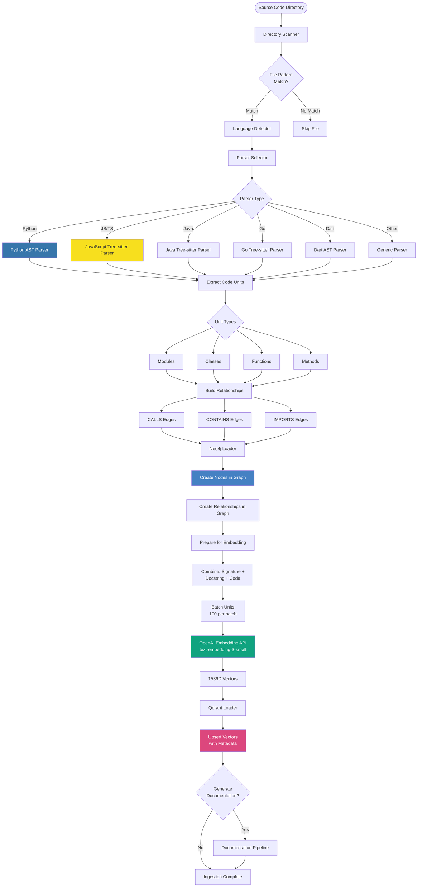
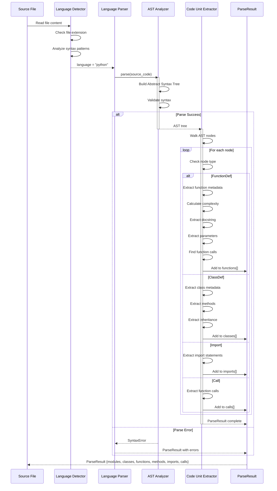
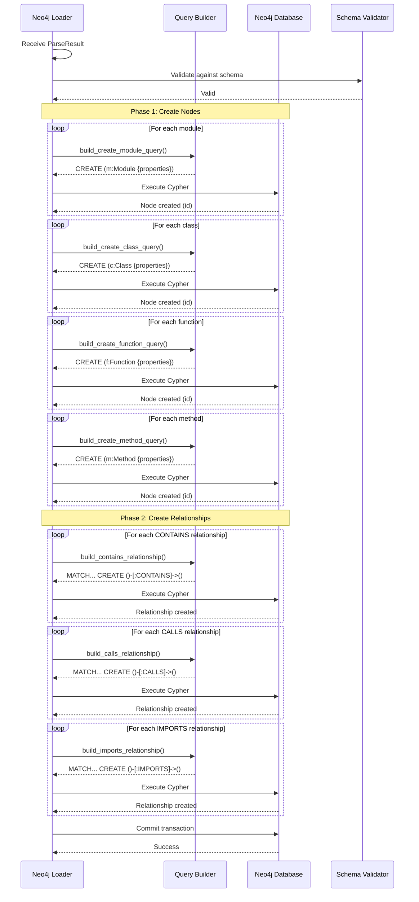
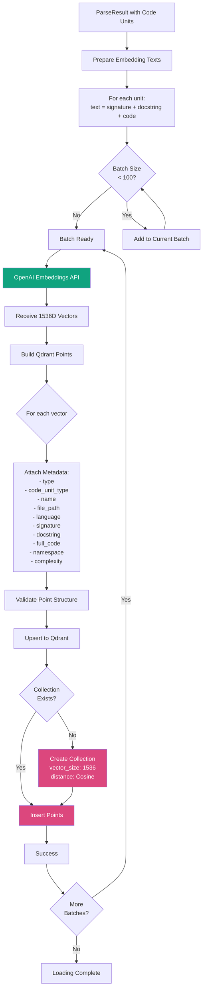
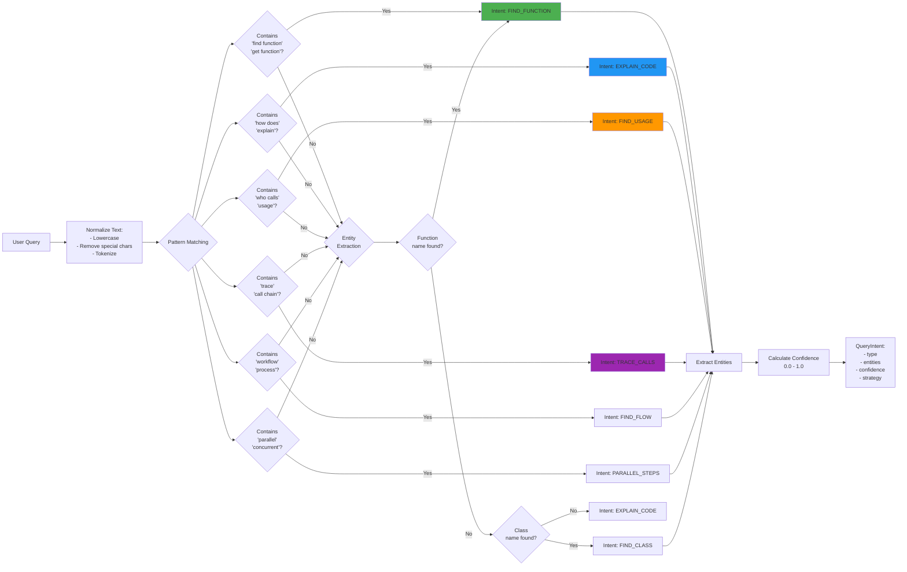
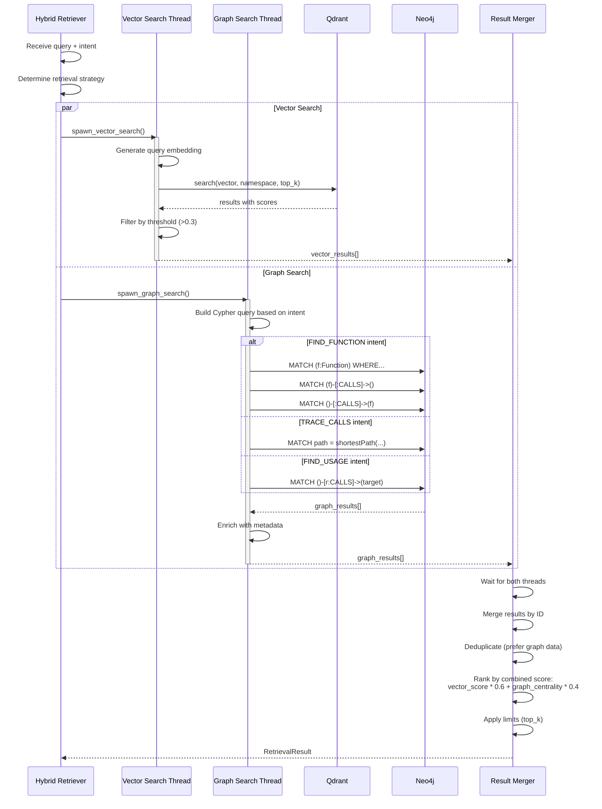
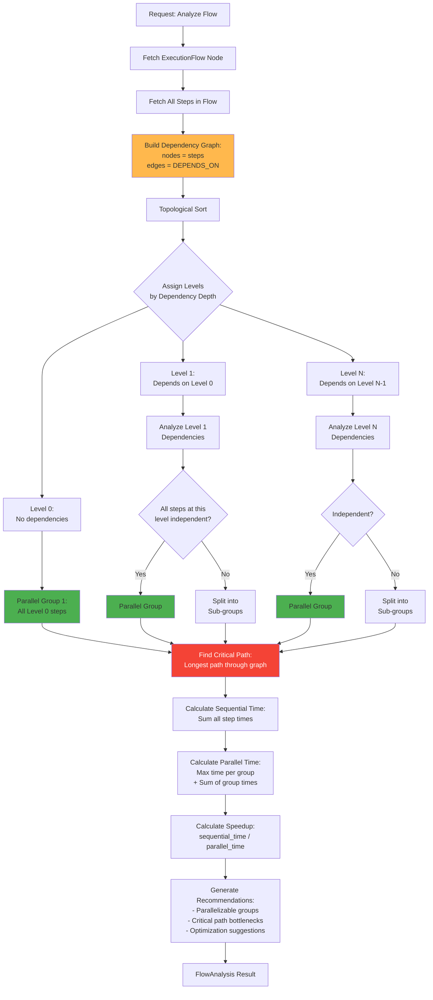
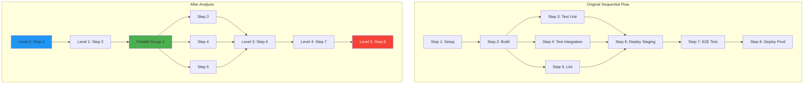
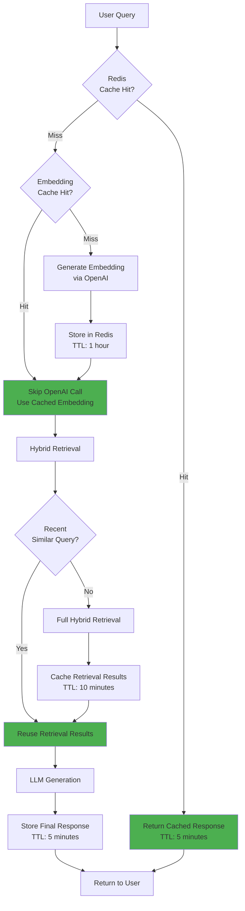

# FlowRAG Data Flow Documentation

## Table of Contents
- [Overview](#overview)
- [Ingestion Data Flow](#ingestion-data-flow)
- [Query Data Flow](#query-data-flow)
- [Flow Analysis Data Flow](#flow-analysis-data-flow)
- [Documentation Generation Data Flow](#documentation-generation-data-flow)
- [Cross-Service Relationship Building](#cross-service-relationship-building)
- [Caching Strategy](#caching-strategy)

---

## Overview

FlowRAG processes data through five main pipelines:
1. **Ingestion Pipeline**: Code → AST → Graph + Vectors
2. **Query Pipeline**: Question → Retrieval → LLM → Answer
3. **Flow Analysis Pipeline**: Workflow → Dependencies → Optimization
4. **Documentation Pipeline**: Code → Analysis → Markdown + Diagrams
5. **Relationship Building**: Services → API Calls → Cross-Service Edges

---

## Ingestion Data Flow

### Complete Ingestion Pipeline



### Detailed Parsing Flow



### Neo4j Loading Flow



### Qdrant Loading Flow



---

## Query Data Flow

### Complete Query Pipeline

```mermaid
flowchart TD
    START([User Query:<br/>"How does authentication work?"]) --> RECEIVE[API Endpoint Receives Request]

    RECEIVE --> VALIDATE[Validate Request:<br/>- Query not empty<br/>- Namespace exists<br/>- Max results valid]

    VALIDATE --> ORCHESTRATE[Orchestrator.orchestrate()]

    ORCHESTRATE --> CLASSIFY[Intent Classifier]
    CLASSIFY --> PATTERNS[Pattern Matching]
    PATTERNS --> EXTRACT[Entity Extraction]
    EXTRACT --> INTENT{Detected Intent}

    INTENT -->|FIND_FUNCTION| STRAT1[Strategy: Hybrid<br/>Vector + Context]
    INTENT -->|EXPLAIN_CODE| STRAT2[Strategy: Full Hybrid]
    INTENT -->|TRACE_CALLS| STRAT3[Strategy: Graph Only]
    INTENT -->|FIND_FLOW| STRAT4[Strategy: Flow Hybrid]

    STRAT1 --> RETRIEVE[Hybrid Retriever]
    STRAT2 --> RETRIEVE
    STRAT3 --> GRAPH_ONLY[Graph Retriever]
    STRAT4 --> RETRIEVE

    RETRIEVE --> PARALLEL{Parallel Retrieval}

    PARALLEL -->|Thread 1| VECTOR_SEARCH[Vector Search]
    PARALLEL -->|Thread 2| GRAPH_SEARCH[Graph Traversal]

    VECTOR_SEARCH --> GEN_EMB[Generate Query Embedding]
    GEN_EMB --> QDRANT_SEARCH[Qdrant.search()]
    QDRANT_SEARCH --> VEC_RESULTS[Vector Results<br/>with Scores]

    GRAPH_SEARCH --> BUILD_CYPHER[Build Intent-Specific<br/>Cypher Query]
    BUILD_CYPHER --> NEO4J_QUERY[Neo4j.execute_query()]
    NEO4J_QUERY --> GRAPH_RESULTS[Graph Results<br/>with Relationships]

    GRAPH_ONLY --> BUILD_CYPHER

    VEC_RESULTS --> MERGE[Merge Results]
    GRAPH_RESULTS --> MERGE

    MERGE --> DEDUP[Deduplicate by ID]
    DEDUP --> RANK[Rank by Relevance:<br/>- Vector score<br/>- Graph centrality<br/>- Recency]

    RANK --> ASSEMBLE[Context Assembler]
    ASSEMBLE --> FORMAT[Format for LLM:<br/>- Add source citations<br/>- Structure context<br/>- Apply token limit]

    FORMAT --> BUILD_PROMPT[Build LLM Prompt:<br/>System + Context + Query]

    BUILD_PROMPT --> LLM_CALL[LLM API Call]
    LLM_CALL --> GPT4{LLM Provider}

    GPT4 -->|OpenAI| OPENAI[GPT-4 API]
    GPT4 -->|Anthropic| CLAUDE[Claude 3 API]

    OPENAI --> RESPONSE[Generated Response]
    CLAUDE --> RESPONSE

    RESPONSE --> ENRICH[Enrich with Metadata:<br/>- Intent<br/>- Sources used<br/>- Retrieval time<br/>- Token count]

    ENRICH --> RETURN[Return to User]

    style CLASSIFY fill:#FFB84D
    style QDRANT_SEARCH fill:#DC477D,color:#fff
    style NEO4J_QUERY fill:#4581C3,color:#fff
    style OPENAI fill:#10A37F,color:#fff
    style CLAUDE fill:#D97757,color:#fff
```

### Intent Classification Detail



### Hybrid Retrieval Strategy



---

## Flow Analysis Data Flow

### Parallelization Detection Pipeline



### Dependency Graph Example



---

## Documentation Generation Data Flow

### Auto-Documentation Pipeline

```mermaid
flowchart TD
    START[Request: Generate Docs<br/>for Namespace] --> ANALYZE[Analyze Codebase Structure]

    ANALYZE --> QUERY_NODES[Query Neo4j:<br/>All nodes in namespace]
    QUERY_NODES --> STATS[Calculate Statistics:<br/>- Total files<br/>- Total classes<br/>- Total functions<br/>- Languages used]

    STATS --> OVERVIEW[Generate Service Overview]
    OVERVIEW --> LLM_OVERVIEW[LLM Call:<br/>Generate description based on structure]

    LLM_OVERVIEW --> DIAGRAMS{Generate Diagrams}

    DIAGRAMS --> ARCH_DIAG[Architecture Diagram]
    DIAGRAMS --> SEQ_DIAG[Sequence Diagram]
    DIAGRAMS --> DATA_DIAG[Data Flow Diagram]

    ARCH_DIAG --> MERMAID_ARCH[Mermaid: Component Graph]
    SEQ_DIAG --> MERMAID_SEQ[Mermaid: API Call Sequence]
    DATA_DIAG --> MERMAID_DATA[Mermaid: Data Layers]

    MERMAID_ARCH --> COMPONENTS[Document Components]
    MERMAID_SEQ --> COMPONENTS
    MERMAID_DATA --> COMPONENTS

    COMPONENTS --> CONTROLLERS[Find Controllers:<br/>Classes with @app.route]
    COMPONENTS --> SERVICES[Find Services:<br/>Classes with business logic]
    COMPONENTS --> MODELS[Find Models:<br/>Data classes]

    CONTROLLERS --> APIs[Document API Endpoints]
    APIS --> ENDPOINT_LOOP{For each endpoint}

    ENDPOINT_LOOP --> ENDPOINT_INFO[Extract:<br/>- HTTP method<br/>- Path<br/>- Handler function<br/>- Parameters<br/>- Response type]

    ENDPOINT_INFO --> ENDPOINT_DOC[Create Endpoint Documentation]

    SERVICES --> SERVICE_DOC[Document Service Methods]
    MODELS --> MODEL_DOC[Document Data Models]

    ENDPOINT_DOC --> INTER_SERVICE[Detect Inter-Service Calls]
    SERVICE_DOC --> INTER_SERVICE
    MODEL_DOC --> INTER_SERVICE

    INTER_SERVICE --> HTTP_CALLS[Find HTTP Client Calls:<br/>- requests.get()<br/>- axios.post()<br/>- fetch()]

    HTTP_CALLS --> SDK_CALLS[Find SDK Calls:<br/>- AWS SDK<br/>- OpenAI<br/>- Stripe]

    SDK_CALLS --> DB_CALLS[Find DB Calls:<br/>- PostgreSQL<br/>- MongoDB<br/>- Redis]

    DB_CALLS --> SERVICE_MAP[Build Service Dependency Map]

    SERVICE_MAP --> MARKDOWN[Generate Markdown]
    MARKDOWN --> SECTIONS{Combine Sections}

    SECTIONS --> SEC1[# Service Overview]
    SECTIONS --> SEC2[## Architecture]
    SECTIONS --> SEC3[## Components]
    SECTIONS --> SEC4[## API Endpoints]
    SECTIONS --> SEC5[## Data Models]
    SECTIONS --> SEC6[## Dependencies]

    SEC1 --> FINAL[Complete Markdown Document]
    SEC2 --> FINAL
    SEC3 --> FINAL
    SEC4 --> FINAL
    SEC5 --> FINAL
    SEC6 --> FINAL

    FINAL --> STORE{Store Documentation}

    STORE --> NEO4J_DOC[Store in Neo4j:<br/>Document node with metadata]
    STORE --> VECTOR_DOC[Chunk and Embed:<br/>Store in Qdrant]

    NEO4J_DOC --> COMPLETE[Documentation Complete]
    VECTOR_DOC --> COMPLETE

    style LLM_OVERVIEW fill:#10A37F,color:#fff
    style MERMAID_ARCH fill:#FF6D00
    style MERMAID_SEQ fill:#FF6D00
    style MERMAID_DATA fill:#FF6D00
    style NEO4J_DOC fill:#4581C3,color:#fff
    style VECTOR_DOC fill:#DC477D,color:#fff
```

---

## Cross-Service Relationship Building

### Service Dependency Detection

```mermaid
flowchart TD
    START[Multiple Services Ingested] --> DETECT[Service Dependency Extractor]

    DETECT --> SCAN_CALLS[Scan for API Calls<br/>in All Services]

    SCAN_CALLS --> HTTP{HTTP Client Patterns}

    HTTP --> PYTHON_HTTP[Python:<br/>requests.get/post<br/>httpx.request<br/>urllib.request]

    HTTP --> JS_HTTP[JavaScript:<br/>axios.get/post<br/>fetch()<br/>superagent]

    HTTP --> JAVA_HTTP[Java:<br/>HttpClient<br/>RestTemplate<br/>OkHttp]

    PYTHON_HTTP --> EXTRACT_URL[Extract URL Patterns]
    JS_HTTP --> EXTRACT_URL
    JAVA_HTTP --> EXTRACT_URL

    EXTRACT_URL --> PARSE_URL[Parse URL Components:<br/>- Protocol<br/>- Host<br/>- Port<br/>- Path]

    PARSE_URL --> MAPPING[Load Service Mappings<br/>JSON Config]

    MAPPING --> MATCH{Match URL<br/>to Service}

    MATCH -->|Match Found| IDENTIFY[Identify Target Service]
    MATCH -->|No Match| LOG_UNKNOWN[Log Unknown External Call]

    IDENTIFY --> FIND_SOURCE[Find Source Function in Neo4j]
    FIND_SOURCE --> FIND_TARGET[Find Target Endpoint in Neo4j]

    FIND_TARGET --> CREATE_REL[Create CALLS_API Relationship]

    CREATE_REL --> REL_PROPS[Add Relationship Properties:<br/>- target_service<br/>- target_url<br/>- http_method<br/>- detected_at]

    REL_PROPS --> NEO4J_CREATE[Neo4j: CREATE Relationship]

    NEO4J_CREATE --> MORE{More<br/>Calls?}
    MORE -->|Yes| SCAN_CALLS
    MORE -->|No| SUMMARY[Generate Summary Report]

    LOG_UNKNOWN --> SUMMARY

    SUMMARY --> RESULT[Cross-Service Map Complete]

    style IDENTIFY fill:#4CAF50
    style CREATE_REL fill:#4581C3,color:#fff
    style NEO4J_CREATE fill:#4581C3,color:#fff
```

### Service Mapping Configuration

```mermaid
graph LR
    CONFIG[Service Mappings JSON] --> MAP1["URL Pattern:<br/>'api.payment.com'<br/>→ Service: 'payment-service'"]
    CONFIG --> MAP2["URL Pattern:<br/>'auth.example.com'<br/>→ Service: 'auth-service'"]
    CONFIG --> MAP3["URL Pattern:<br/>'localhost:8001'<br/>→ Service: 'user-service'"]

    MAP1 --> DETECTOR[Service Call Detector]
    MAP2 --> DETECTOR
    MAP3 --> DETECTOR

    DETECTOR --> HTTP_CALL[HTTP Call Found:<br/>'https://api.payment.com/charge']

    HTTP_CALL --> MATCH[Pattern Matching]
    MATCH --> IDENTIFIED[Identified: payment-service]

    IDENTIFIED --> GRAPH[Create Graph Relationship:<br/>caller-function-[:CALLS_API]->payment-service]

    style CONFIG fill:#FFB84D
    style GRAPH fill:#4581C3,color:#fff
```

---

## Caching Strategy

### Multi-Level Caching



---

## Summary

### Data Flow Characteristics

| Pipeline | Latency | Throughput | Bottleneck |
|----------|---------|------------|------------|
| **Ingestion** | 0.5-2s per file | 1-2 files/sec | OpenAI embedding API |
| **Query (Vector)** | 50-100ms | 100 QPS | Qdrant search |
| **Query (Graph)** | 20-50ms | 200 QPS | Neo4j traversal |
| **Query (LLM)** | 2-5s | 10 QPS | GPT-4 generation |
| **Flow Analysis** | 100-500ms | 50 QPS | Graph traversal |
| **Documentation** | 10-30s | 1 per minute | LLM generation |

### Optimization Strategies

1. **Batching**: Group embeddings (100 per batch)
2. **Caching**: Multi-level (Redis for queries, in-memory for embeddings)
3. **Parallel Retrieval**: Vector + Graph search concurrently
4. **Connection Pooling**: Reuse database connections
5. **Async I/O**: Non-blocking database operations
6. **Rate Limiting**: Prevent OpenAI API throttling

---

**Next**: [Hybrid RAG Explained](./06_HYBRID_RAG.md) | [Back to Index](./README.md)
