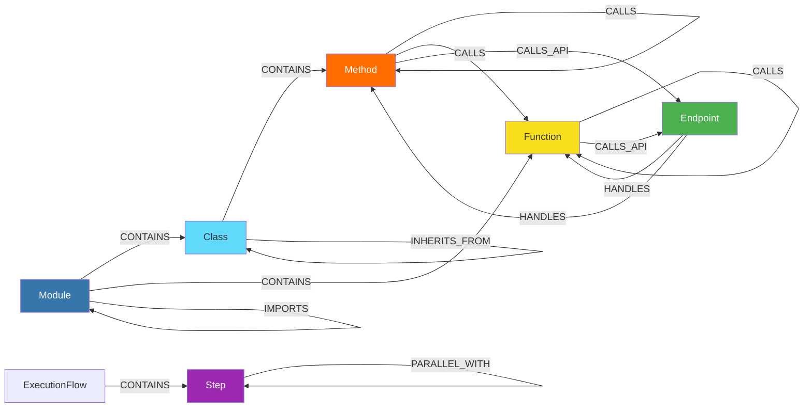
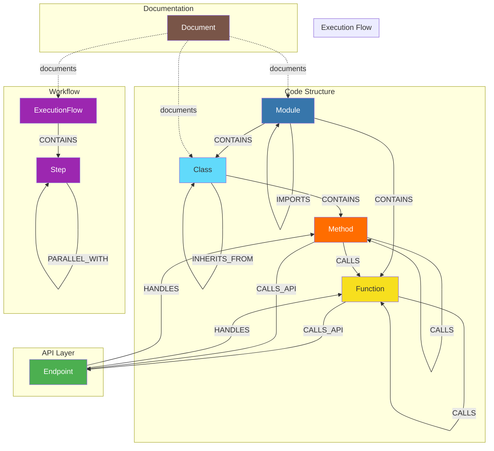
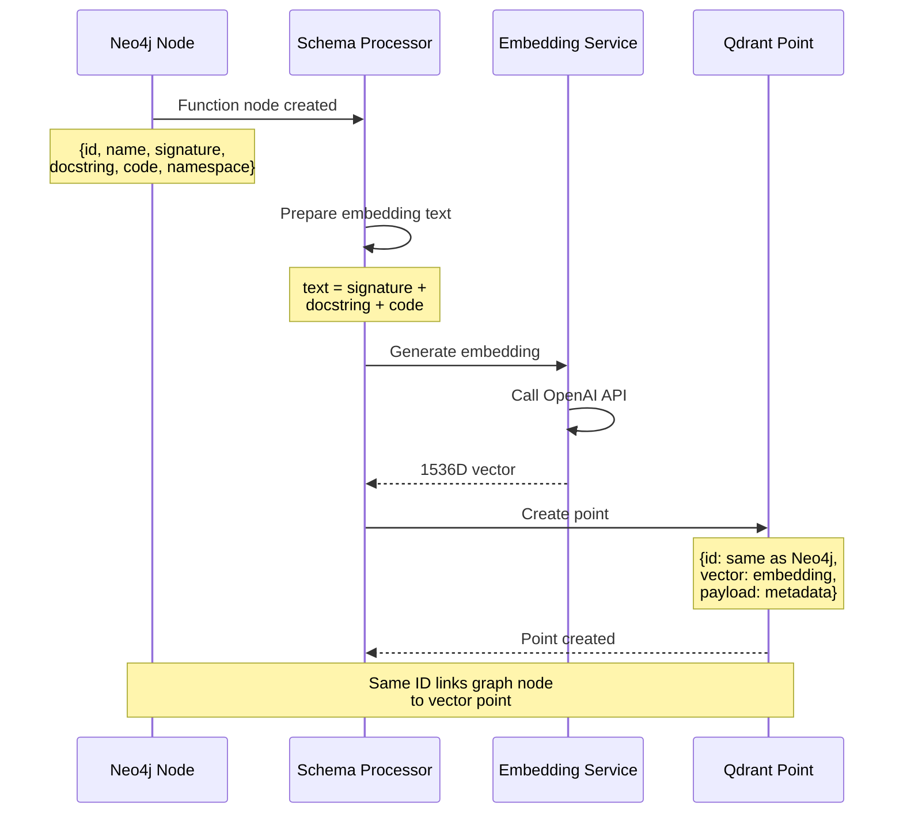
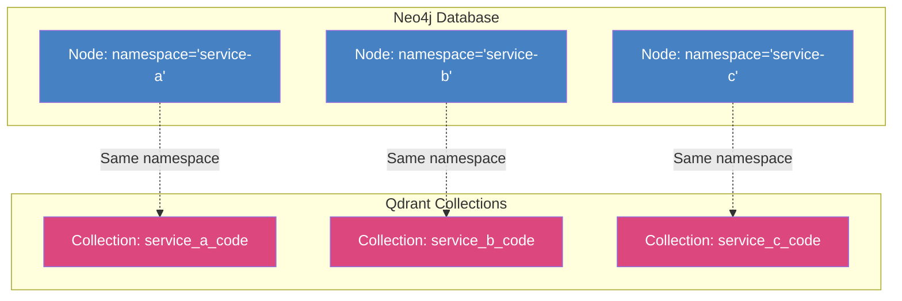
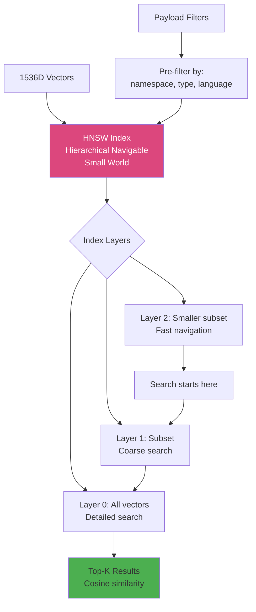
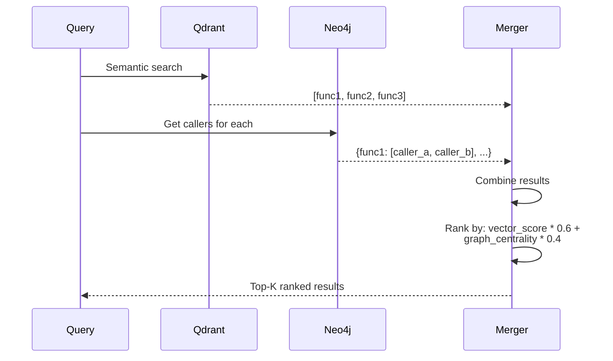
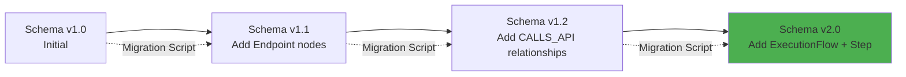

# FlowRAG Database Schema Documentation

## Table of Contents
- [Overview](#overview)
- [Neo4j Graph Database Schema](#neo4j-graph-database-schema)
- [Qdrant Vector Database Schema](#qdrant-vector-database-schema)
- [Schema Relationships](#schema-relationships)
- [Indexing Strategy](#indexing-strategy)
- [Query Patterns](#query-patterns)

---

## Overview

FlowRAG uses a **dual-database architecture**:
1. **Neo4j**: Stores code structure and relationships (graph)
2. **Qdrant**: Stores semantic embeddings (vectors)

Both databases share a common **namespace** concept for multi-tenancy.

---

## Neo4j Graph Database Schema

### Node Types

```mermaid
erDiagram
    Module {
        string id PK "Unique identifier"
        string name "Module/file name"
        string file_path "Absolute file path"
        string language "Programming language"
        string namespace "Tenant/project namespace"
        int total_lines "Lines of code"
        datetime created_at "Ingestion timestamp"
    }

    Class {
        string id PK
        string name "Class name"
        string file_path "Source file"
        string signature "Full class signature"
        string docstring "Class documentation"
        string namespace
        int line_start "Start line number"
        int line_end "End line number"
        string[] base_classes "Inheritance"
        datetime created_at
    }

    Function {
        string id PK
        string name "Function name"
        string signature "Type-annotated signature"
        string docstring "Function documentation"
        string full_code "Complete source code"
        int complexity "Cyclomatic complexity"
        string[] parameters "Parameter names"
        string return_type "Return type annotation"
        string namespace
        int line_start
        int line_end
        datetime created_at
    }

    Method {
        string id PK
        string name "Method name"
        string signature
        string docstring
        string full_code
        int complexity
        string[] parameters
        string return_type
        string class_name "Parent class"
        string namespace
        int line_start
        int line_end
        boolean is_static
        boolean is_async
        datetime created_at
    }

    Endpoint {
        string id PK
        string path "API route path"
        string http_method "GET|POST|PUT|DELETE"
        string handler_function "Handler function ID"
        string[] parameters "Path/query params"
        string request_body_type "Request schema"
        string response_type "Response schema"
        string namespace
        datetime created_at
    }

    ExecutionFlow {
        string id PK
        string name "Workflow/process name"
        string description
        string flow_type "CI/CD|Data Pipeline|Business Process"
        int total_steps "Number of steps"
        string namespace
        datetime created_at
    }

    Step {
        string id PK
        string name "Step name"
        string description
        int sequence_number "Order in flow"
        float estimated_time "Time in seconds"
        string command "Shell command or code"
        string[] dependencies "IDs of prerequisite steps"
        string namespace
        datetime created_at
    }

    Document {
        string id PK
        string title "Document title"
        string content "Markdown content"
        string doc_type "Service Overview|API Docs|README"
        string namespace
        datetime created_at
        datetime updated_at
    }
```

### Relationship Types



### Relationship Properties

#### CONTAINS
```cypher
()-[:CONTAINS {
  defined_at: int,           // Line number where contained element starts
  scope: string             // public|private|protected
}]->()
```

#### CALLS
```cypher
()-[:CALLS {
  line_number: int,         // Where the call occurs
  is_async: boolean,        // Async/await call
  call_count: int          // Number of times called (aggregated)
}]->()
```

#### CALLS_API
```cypher
()-[:CALLS_API {
  target_service: string,   // External service name
  target_url: string,       // Full URL called
  http_method: string,      // GET|POST|etc
  detected_at: int         // Line number
}]->()
```

#### DEPENDS_ON
```cypher
(step1:Step)-[:DEPENDS_ON {
  dependency_type: string,  // data|control|resource
  is_hard: boolean         // Hard vs soft dependency
}]->(step2:Step)
```

#### PARALLEL_WITH
```cypher
(step1:Step)-[:PARALLEL_WITH {
  verified: boolean,        // Manually verified parallelization
  estimated_speedup: float // Potential time savings
}]->(step2:Step)
```

### Complete Schema Diagram



### Schema Constraints and Indexes

```cypher
-- Unique Constraints
CREATE CONSTRAINT module_id_unique IF NOT EXISTS
FOR (m:Module) REQUIRE m.id IS UNIQUE;

CREATE CONSTRAINT class_id_unique IF NOT EXISTS
FOR (c:Class) REQUIRE c.id IS UNIQUE;

CREATE CONSTRAINT function_id_unique IF NOT EXISTS
FOR (f:Function) REQUIRE f.id IS UNIQUE;

CREATE CONSTRAINT method_id_unique IF NOT EXISTS
FOR (m:Method) REQUIRE m.id IS UNIQUE;

CREATE CONSTRAINT endpoint_id_unique IF NOT EXISTS
FOR (e:Endpoint) REQUIRE e.id IS UNIQUE;

CREATE CONSTRAINT step_id_unique IF NOT EXISTS
FOR (s:Step) REQUIRE s.id IS UNIQUE;

-- Indexes for Performance
CREATE INDEX module_namespace IF NOT EXISTS
FOR (m:Module) ON (m.namespace);

CREATE INDEX module_file_path IF NOT EXISTS
FOR (m:Module) ON (m.file_path);

CREATE INDEX function_name IF NOT EXISTS
FOR (f:Function) ON (f.name);

CREATE INDEX function_namespace IF NOT EXISTS
FOR (f:Function) ON (f.namespace);

CREATE INDEX class_name IF NOT EXISTS
FOR (c:Class) ON (c.name);

CREATE INDEX endpoint_path IF NOT EXISTS
FOR (e:Endpoint) ON (e.path);

CREATE INDEX step_sequence IF NOT EXISTS
FOR (s:Step) ON (s.sequence_number);

-- Composite Indexes
CREATE INDEX function_namespace_name IF NOT EXISTS
FOR (f:Function) ON (f.namespace, f.name);

CREATE INDEX class_namespace_name IF NOT EXISTS
FOR (c:Class) ON (c.namespace, c.name);
```

---

## Qdrant Vector Database Schema

### Collection Structure

```mermaid
graph TB
    subgraph "Collection: namespace_code"
        POINT1[Point 1]
        POINT2[Point 2]
        POINT3[Point N]
    end

    subgraph "Point Structure"
        ID[id: string]
        VECTOR[vector: float[1536]]
        PAYLOAD[payload: dict]
    end

    subgraph "Payload Schema"
        TYPE[type: code|document|documentation]
        CODE_TYPE[code_unit_type: function|class|method|module]
        NAME[name: string]
        FILE[file_path: string]
        LANG[language: string]
        SIG[signature: string]
        DOC[docstring: string]
        CODE[full_code: string]
        NS[namespace: string]
        COMPLEX[complexity: int]
        LINES[line_start: int, line_end: int]
    end

    POINT1 --> ID
    POINT1 --> VECTOR
    POINT1 --> PAYLOAD

    PAYLOAD --> TYPE
    PAYLOAD --> CODE_TYPE
    PAYLOAD --> NAME
    PAYLOAD --> FILE
    PAYLOAD --> LANG
    PAYLOAD --> SIG
    PAYLOAD --> DOC
    PAYLOAD --> CODE
    PAYLOAD --> NS
    PAYLOAD --> COMPLEX
    PAYLOAD --> LINES

    style POINT1 fill:#DC477D,color:#fff
    style POINT2 fill:#DC477D,color:#fff
    style POINT3 fill:#DC477D,color:#fff
    style VECTOR fill:#10A37F,color:#fff
```

### Vector Point Schema

```json
{
  "id": "function_auth_service_validate_token_123",
  "vector": [0.023, -0.145, 0.892, ...], // 1536 dimensions
  "payload": {
    "type": "code",
    "code_unit_type": "function",
    "name": "validate_token",
    "file_path": "/auth/service.py",
    "language": "python",
    "signature": "def validate_token(token: str, secret: str) -> dict",
    "docstring": "Validates a JWT token and returns the decoded payload",
    "full_code": "def validate_token(token: str, secret: str) -> dict:\n    \"\"\"Validates a JWT token...\"\"\"\n    try:\n        payload = jwt.decode(token, secret)\n        return payload\n    except JWTError:\n        raise AuthenticationError()",
    "namespace": "auth-service",
    "complexity": 3,
    "line_start": 45,
    "line_end": 52
  }
}
```

### Collection Configuration

```python
{
    "collection_name": "namespace_code",  // Per-namespace collection
    "config": {
        "params": {
            "vectors": {
                "size": 1536,              // OpenAI ada-002 dimensions
                "distance": "Cosine"       // Similarity metric
            }
        },
        "optimizer_config": {
            "deleted_threshold": 0.2,
            "vacuum_min_vector_number": 1000,
            "default_segment_number": 0,
            "max_segment_size": 200000,
            "memmap_threshold": 50000,
            "indexing_threshold": 20000,
            "flush_interval_sec": 5,
            "max_optimization_threads": 1
        },
        "wal_config": {
            "wal_capacity_mb": 32,
            "wal_segments_ahead": 0
        }
    }
}
```

### Payload Indexes

```python
# Create payload indexes for efficient filtering
client.create_payload_index(
    collection_name="namespace_code",
    field_name="namespace",
    field_schema="keyword"
)

client.create_payload_index(
    collection_name="namespace_code",
    field_name="type",
    field_schema="keyword"
)

client.create_payload_index(
    collection_name="namespace_code",
    field_name="code_unit_type",
    field_schema="keyword"
)

client.create_payload_index(
    collection_name="namespace_code",
    field_name="language",
    field_schema="keyword"
)
```

---

## Schema Relationships

### Graph to Vector Mapping



### Namespace Isolation



---

## Indexing Strategy

### Neo4j Index Strategy

```mermaid
graph LR
    subgraph "Primary Indexes"
        I1[Unique ID Constraints<br/>O(1) lookup]
    end

    subgraph "Secondary Indexes"
        I2[namespace index<br/>Fast filtering]
        I3[name index<br/>Text search]
        I4[file_path index<br/>File-based queries]
    end

    subgraph "Composite Indexes"
        I5[namespace + name<br/>Combined filtering]
    end

    QUERY[User Query] --> I1
    QUERY --> I2
    QUERY --> I3
    QUERY --> I4
    QUERY --> I5

    I1 --> FAST[Fast Retrieval<br/>< 10ms]
    I2 --> FAST
    I3 --> FAST
    I4 --> FAST
    I5 --> FAST

    style I1 fill:#4CAF50
    style I2 fill:#2196F3
    style I3 fill:#2196F3
    style I4 fill:#2196F3
    style I5 fill:#FF9800
```

### Qdrant Index Strategy



---

## Query Patterns

### Pattern 1: Find Function and Its Callers

```cypher
// Neo4j: Graph traversal
MATCH (target:Function {name: $function_name, namespace: $namespace})
OPTIONAL MATCH (caller)-[:CALLS]->(target)
RETURN target, collect(caller) as callers
```

```python
# Qdrant: Semantic search
results = qdrant_client.search(
    collection_name=f"{namespace}_code",
    query_vector=embedding,
    query_filter={
        "must": [
            {"key": "namespace", "match": {"value": namespace}},
            {"key": "type", "match": {"value": "code"}},
            {"key": "code_unit_type", "match": {"value": "function"}}
        ]
    },
    limit=10
)
```

### Pattern 2: Trace Call Chain

```cypher
// Neo4j: Shortest path
MATCH (start:Function {name: $start_function, namespace: $namespace}),
      (end:Function {name: $end_function, namespace: $namespace})
MATCH path = shortestPath((start)-[:CALLS*]->(end))
RETURN path, length(path) as call_depth
```

### Pattern 3: Find Cross-Service API Calls

```cypher
// Neo4j: Filter by relationship type
MATCH (caller)-[r:CALLS_API]->(callee)
WHERE caller.namespace = $source_namespace
  AND callee.namespace <> $source_namespace
RETURN caller.name as caller_function,
       callee.namespace as target_service,
       r.target_url as endpoint,
       r.http_method as method
```

### Pattern 4: Hybrid Search (Graph + Vector)



### Pattern 5: Find Parallelizable Steps

```cypher
// Neo4j: Topological analysis
MATCH (flow:ExecutionFlow {id: $flow_id})
MATCH (step:Step)-[:PART_OF]->(flow)
OPTIONAL MATCH (step)-[d:DEPENDS_ON]->(dependency:Step)
WITH step, collect(dependency) as deps
WHERE size(deps) = 0  // No dependencies
RETURN step.name, step.sequence_number
ORDER BY step.sequence_number
```

---

## Schema Evolution and Migration

### Version Control



### Migration Example

```cypher
// Migration: Add new property to existing nodes
MATCH (f:Function)
WHERE NOT EXISTS(f.is_async)
SET f.is_async = false
RETURN count(f) as updated_functions
```

```python
# Qdrant: Re-index with new metadata
for point in old_points:
    updated_payload = {
        **point.payload,
        "complexity": calculate_complexity(point.payload["full_code"])
    }
    client.upsert(
        collection_name=collection,
        points=[{
            "id": point.id,
            "vector": point.vector,
            "payload": updated_payload
        }]
    )
```

---

## Performance Characteristics

### Neo4j Query Performance

| Query Type | Complexity | Avg Time | Index Used |
|------------|-----------|----------|------------|
| **Node by ID** | O(1) | < 5ms | Unique constraint |
| **Filter by namespace** | O(log n) | < 20ms | Namespace index |
| **Call chain (depth 5)** | O(k * d) | < 50ms | CALLS relationship |
| **Find all callers** | O(k) | < 30ms | Reverse CALLS |
| **Cross-service calls** | O(n) | < 100ms | CALLS_API filter |

### Qdrant Search Performance

| Search Type | Complexity | Avg Time | Params |
|-------------|-----------|----------|--------|
| **Semantic search** | O(log n) | < 100ms | HNSW index, top_k=10 |
| **Filtered search** | O(log n + f) | < 150ms | Payload filter + vector |
| **Multi-namespace** | O(k * log n) | < 200ms | Multiple collections |

---

## Summary

### Schema Design Principles

1. **Denormalization**: Store frequently accessed data in both databases
2. **ID Consistency**: Same IDs in Neo4j and Qdrant for easy linking
3. **Namespace Isolation**: Complete separation between tenants
4. **Index Coverage**: Index all frequently queried properties
5. **Relationship Richness**: Use relationship properties for metadata

### Best Practices

1. **Always filter by namespace** to ensure tenant isolation
2. **Use batch operations** for bulk inserts (Neo4j transactions, Qdrant upserts)
3. **Leverage indexes** for all WHERE clauses
4. **Combine graph + vector** for hybrid retrieval
5. **Version your schema** with migration scripts

---

**Next**: [API Reference](./13_API_REFERENCE.md) | [Back to Index](./README.md)
