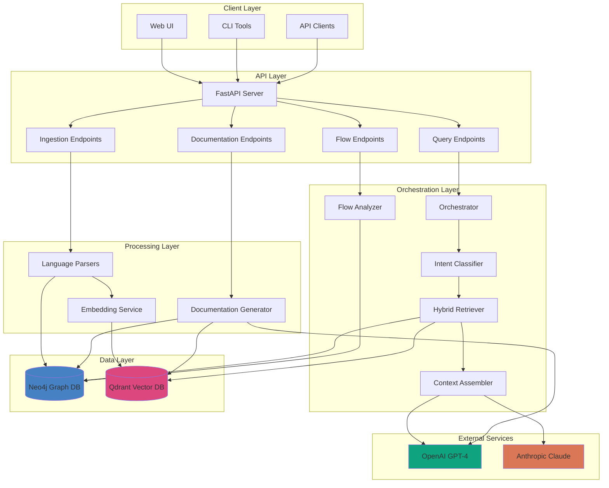

# FlowRAG - Hybrid Graph + Vector RAG System

## Welcome to FlowRAG Documentation

FlowRAG is a production-ready **Hybrid Graph RAG (Retrieval-Augmented Generation)** system that combines graph databases with vector search for intelligent code understanding, execution flow analysis, and automated documentation generation.

## What is FlowRAG?

FlowRAG is a versatile system that works with both **software code** and **business processes**:

### For Software Engineering
- **Understand Complex Codebases**: Ask natural language questions about your code
- **Trace Execution Flows**: Visualize how functions call each other across services
- **Detect Parallelization Opportunities**: Automatically identify steps that can run concurrently
- **Generate Documentation**: Auto-create comprehensive service documentation with diagrams
- **Analyze Microservice Architectures**: Map dependencies and integration points
- **Semantic Code Search**: Find relevant code using natural language queries

### For Manufacturing & Operations
- **Process Optimization**: Analyze manufacturing workflows from PDF manuals
- **Bottleneck Detection**: Find inefficiencies in production lines
- **Supply Chain Analysis**: Map supplier dependencies and risks
- **Quality Control**: Trace quality procedures across documentation
- **Equipment Maintenance**: Track maintenance schedules and prevent downtime
- **Root Cause Analysis**: Correlate defects with process changes

## Quick Start

```bash
# 1. Setup environment
cp .env.example .env
# Add OPENAI_API_KEY and NEO4J_PASSWORD

# 2. Start databases
docker-compose up -d

# 3. Install dependencies
python3 -m venv venv
source venv/bin/activate
pip install -r requirements.txt

# 4. Run the API server
uvicorn api.main:app --reload

# 5. Ingest your code
curl -X POST http://localhost:8000/api/v1/ingest/directory \
  -H "Content-Type: application/json" \
  -d '{
    "directory_path": "/path/to/your/code",
    "namespace": "my-project",
    "recursive": true
  }'

# 6. Query your codebase
curl -X POST http://localhost:8000/api/v1/query \
  -H "Content-Type: application/json" \
  -d '{
    "query": "How does authentication work?",
    "namespace": "my-project"
  }'
```

## Documentation Index

### Getting Started
- **[Understanding FlowRAG](./00_UNDERSTANDING_FLOWRAG.md)** - Plain English guide with real examples ⭐ **Start Here!**
- [Installation Guide](./01_INSTALLATION.md) - Setup and configuration
- [Quick Start Tutorial](./02_QUICK_START.md) - Your first FlowRAG project
- [Configuration Guide](./03_CONFIGURATION.md) - Environment variables and settings

### Core Concepts
- [Architecture Overview](./04_ARCHITECTURE.md) - System design and components
- [Data Flow](./05_DATA_FLOW.md) - How data moves through the system
- [Hybrid RAG Explained](./06_HYBRID_RAG.md) - Graph + Vector retrieval

### User Guides
- [Ingestion Guide](./07_INGESTION.md) - How to ingest code into FlowRAG
- [Query Guide](./08_QUERYING.md) - How to query your codebase
- [Flow Analysis Guide](./09_FLOW_ANALYSIS.md) - Execution flow optimization
- [Documentation Generation](./10_DOCUMENTATION_GENERATION.md) - Auto-docs feature

### Technical Deep Dives
- [Parser Implementation](./11_PARSERS.md) - Language parsers and AST extraction
- [Database Schema](./12_DATABASE_SCHEMA.md) - Neo4j and Qdrant schemas
- [API Reference](./13_API_REFERENCE.md) - REST API endpoints
- [LLM Integration](./14_LLM_INTEGRATION.md) - OpenAI and Anthropic setup

### Advanced Topics
- [Multi-Service Analysis](./15_MULTI_SERVICE.md) - Microservice architecture mapping
- [Custom Parsers](./16_CUSTOM_PARSERS.md) - Adding new language support
- [Performance Tuning](./17_PERFORMANCE.md) - Optimization tips
- [Production Deployment](./18_DEPLOYMENT.md) - Docker, Kubernetes, scaling

### Reference
- [Troubleshooting](./19_TROUBLESHOOTING.md) - Common issues and solutions
- [FAQ](./20_FAQ.md) - Frequently asked questions
- [Glossary](./21_GLOSSARY.md) - Key terms and concepts

## System Architecture Overview



## Key Features

### 1. Multi-Language Support
- Python, JavaScript/TypeScript, Java, Go, Dart, PHP, Ruby
- Extensible parser architecture for adding new languages

### 2. Hybrid Retrieval
- **Vector Search**: Semantic similarity using OpenAI embeddings (1536D)
- **Graph Traversal**: Relationship-based search using Neo4j
- **Intent-Driven**: Automatically selects best retrieval strategy

### 3. Flow Analysis
- Execution flow tracing across function calls
- Automatic parallelization opportunity detection
- Critical path identification
- Performance optimization recommendations

### 4. Auto-Documentation
- LLM-powered service overviews
- Mermaid architecture diagrams
- Component and API documentation
- Inter-service dependency mapping

### 5. Microservice Architecture Analysis
- Cross-service API call detection
- Service dependency graphs
- Integration point identification
- Request flow visualization

## Technology Stack

| Component | Technology | Purpose |
|-----------|-----------|---------|
| **API Server** | FastAPI | REST API endpoints |
| **Graph Database** | Neo4j 5.13+ | Code structure and relationships |
| **Vector Database** | Qdrant | Semantic embeddings |
| **Embeddings** | OpenAI ada-002 | 1536D vectors |
| **LLM** | GPT-4 / Claude 3 | Response generation |
| **Language Parsing** | AST + Tree-sitter | Multi-language code parsing |
| **Orchestration** | Python async/await | Query coordination |

## Use Cases

### 1. Code Understanding
**Scenario**: New developer joining a large codebase

```bash
# Ask natural language questions
"How does user authentication work in this service?"
"What are all the API endpoints for user management?"
"Show me the data flow for order processing"
```

### 2. Microservice Analysis
**Scenario**: Understanding service dependencies

```bash
# Analyze cross-service communication
"Which services depend on the authentication service?"
"What is the request flow for creating an order?"
"Generate architecture diagram for all services"
```

### 3. Performance Optimization
**Scenario**: Identifying parallelization opportunities

```bash
# Analyze execution flows
"Which steps in the CI/CD pipeline can run in parallel?"
"What is the critical path for this workflow?"
"How much speedup can we gain from parallelization?"
```

### 4. Documentation Generation
**Scenario**: Creating service documentation

```bash
# Auto-generate comprehensive docs
"Generate documentation for the payment service"
"Create architecture diagrams with Mermaid"
"Document all API endpoints and data models"
```

## Example Queries

### Service-Level Queries
```python
# Find specific functions
"Find the function that handles user login"

# Explain code behavior
"Explain how the ShopKeyProvider works"

# Trace dependencies
"What functions does the payment processor call?"
```

### Platform-Level Queries
```python
# Overall architecture
"What is the overall architecture of the QBlock platform?"

# Service interactions
"How do all the services work together?"

# Data flow
"Show me the data flow from mobile app to database"
```

### Flow Analysis Queries
```python
# Parallelization
"Which steps in this 25-step pipeline can run in parallel?"

# Critical path
"What is the critical path for the deployment workflow?"

# Optimization
"How can I optimize the execution time of this process?"
```

## Performance Metrics

Based on production testing with QBlock platform (6 microservices, 176 files):

| Metric | Value |
|--------|-------|
| **Ingestion Speed** | ~1.5 files/second |
| **Query Response Time** | 3-8 seconds |
| **Vector Search Accuracy** | 50-57% similarity scores |
| **Graph Nodes** | 865 nodes (6 services) |
| **Vector Embeddings** | 905 vectors (1536D) |
| **Cross-Service Relationships** | 14 CALLS_API edges |

## Community and Support

- **GitHub Issues**: Report bugs and request features
- **Documentation**: Comprehensive guides in `/docs`
- **Examples**: QBlock test suite in `/qblock-test`
- **API Reference**: Interactive docs at `/docs` when server running

## License

[Add your license information here]

## Contributing

Contributions are welcome! See [CONTRIBUTING.md](./CONTRIBUTING.md) for guidelines.

---

**Ready to get started?** → [Installation Guide](./01_INSTALLATION.md)

**Have questions?** → [FAQ](./20_FAQ.md)

**Need help?** → [Troubleshooting](./19_TROUBLESHOOTING.md)
