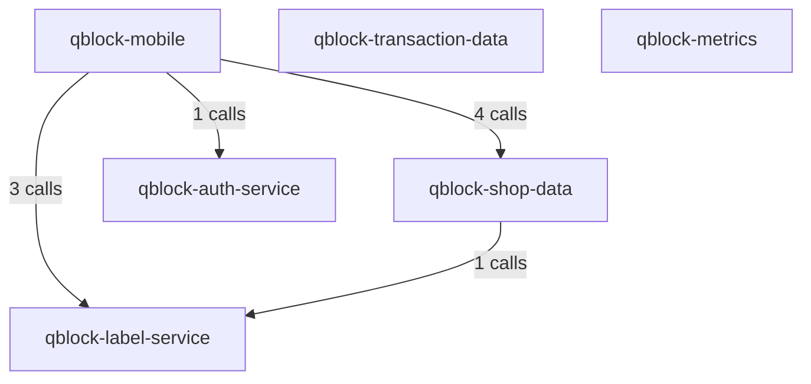

# QBlock Platform - FlowRAG Test & Demo

This folder contains test scripts, documentation, and examples for using FlowRAG with the QBlock e-commerce platform.

## Overview

QBlock is a microservices-based e-commerce platform consisting of 6 services:
- **qblock-mobile** (Flutter/Dart) - Mobile app entry point
- **qblock-shop-data** (TypeScript) - Shop configuration and data management
- **qblock-label-service** (TypeScript) - Shipping label creation
- **qblock-auth-service** (Next.js/TypeScript) - Authentication and store integration
- **qblock-transaction-data** (TypeScript) - Transaction management
- **qblock-metrics** (JavaScript) - Metrics collection

## Files in this Directory

### Configuration
- [`qblock_service_mappings.json`](qblock_service_mappings.json) - Service URL-to-namespace mappings for cross-service dependency detection

### Ingestion Scripts
- [`qblock_ingest_with_docs.sh`](qblock_ingest_with_docs.sh) - Sequential ingestion of all 6 services with documentation generation
- [`qblock_ingest_sequential.sh`](qblock_ingest_sequential.sh) - Sequential ingestion without documentation (faster)

### Query Scripts
- [`query_flowrag.py`](query_flowrag.py) - Query individual services (e.g., "What is ShopKeyProvider?")
- [`query_platform_flow.py`](query_platform_flow.py) - Query overall platform architecture and flow

### Verification
- [`verify_qblock_ingestion.py`](verify_qblock_ingestion.py) - Verify ingestion results in Neo4j and Qdrant

### Documentation
- [`QBLOCK_INGESTION_VERIFICATION.md`](QBLOCK_INGESTION_VERIFICATION.md) - Complete verification report with statistics

## Quick Start

### 1. Ingest QBlock Platform

```bash
# Make sure Neo4j and Qdrant are running
cd /Users/prashanthboovaragavan/Documents/workspace/privateLLM

# Clean previous data (optional)
./manage_neo4j.sh clean

# Ingest all services with documentation
./flowrag-master/qblock-test/qblock_ingest_with_docs.sh

# Build cross-service relationships
cd flowrag-master
./venv/bin/python3 ../build_service_relationships.py --config qblock-test/qblock_service_mappings.json
```

### 2. Verify Ingestion

```bash
cd flowrag-master
unset DEBUG && ./venv/bin/python3 qblock-test/verify_qblock_ingestion.py
```

### 3. Query the Platform

**Ask about a specific service:**
```bash
cd flowrag-master
unset DEBUG && ./venv/bin/python3 qblock-test/query_flowrag.py "What is the purpose of ShopKeyProvider?"
```

**Ask about overall architecture:**
```bash
cd flowrag-master
unset DEBUG && ./venv/bin/python3 qblock-test/query_platform_flow.py "What is the overall flow for QBlock?"
```

## Query Examples

### Service-Level Queries

```bash
# Authentication service
./query_flowrag.py "What is the purpose of ShopKeyProvider in the microservice flow?"

# Label service
./query_flowrag.py "How does label creation work?"

# Mobile app
./query_flowrag.py "What does the mobile app do?"

# Shop data service
./query_flowrag.py "What is ShopDataProvider responsible for?"
```

### Platform-Level Queries

```bash
# Overall architecture
./query_platform_flow.py "What is the overall flow for QBlock platform?"

# Service interactions
./query_platform_flow.py "How do all the QBlock services work together?"

# Architecture patterns
./query_platform_flow.py "Explain the QBlock architecture and design patterns"
```

## What Gets Ingested

### Neo4j (Graph Database)
- **865 total nodes** across 6 services
- **Classes, Functions, Methods** from source code
- **Relationships**:
  - `CALLS` - Function/method calls within a service
  - `CALLS_API` - HTTP/REST API calls between services
  - `IMPORTS` - Import statements
  - `CONTAINS` - Containment relationships

### Qdrant (Vector Database)
- **905 total vectors** with 1536-dimensional embeddings
- **Code embeddings** (859) - Functions, classes, methods
- **Documentation chunk embeddings** (40) - Semantic chunks from generated docs
- **Service summary embeddings** (6) - High-level service overviews

## Architecture Diagram



**Service Roles:**
- **Entry Point**: qblock-mobile (initiates requests)
- **Middleware/Orchestrator**: qblock-shop-data (provides and consumes)
- **Leaf Services**: qblock-auth-service, qblock-label-service (provide functionality)

## Ingestion Statistics

| Service | Files | Nodes | Vectors | Code | Docs | Time |
|---------|-------|-------|---------|------|------|------|
| qblock-mobile | 47 | 57 | 67 | 58 | 9 | 25.6s |
| qblock-label-service | 23 | 313 | 320 | 313 | 7 | 23.3s |
| qblock-auth-service | 16 | 76 | 84 | 76 | 8 | 15.7s |
| qblock-shop-data | 52 | 392 | 402 | 391 | 11 | 34.3s |
| qblock-transaction-data | 35 | 15 | 21 | 15 | 6 | 12.4s |
| qblock-metrics | 3 | 6 | 11 | 6 | 5 | 7.1s |

**Total**: 176 files, 859 nodes, 905 vectors in ~118 seconds

## Cross-Service API Calls Detected

- `qblock-mobile` → `qblock-shop-data`: 6 calls
- `qblock-mobile` → `qblock-label-service`: 4 calls
- `qblock-mobile` → `qblock-auth-service`: 1 call
- `qblock-shop-data` → `qblock-label-service`: 1 call

**Total**: 14 cross-service CALLS_API relationships

## Query System Architecture

### Hybrid RAG Pipeline

1. **Vector Search** (Qdrant)
   - Semantic search for documentation
   - Code similarity search
   - Documentation chunk retrieval

2. **Graph Analysis** (Neo4j)
   - Service relationship queries
   - Dependency analysis
   - Component discovery

3. **LLM Synthesis** (GPT-4)
   - Combines graph + vector data
   - Generates natural language answers
   - Provides architectural insights

## Troubleshooting

### Common Issues

**DEBUG environment variable error:**
```bash
# Always run with unset DEBUG
unset DEBUG && ./venv/bin/python3 script.py
```

**Neo4j authentication error:**
```bash
# Make sure you're in flowrag-master directory where .env is located
cd flowrag-master
```

**Qdrant version warning:**
- Warning about client/server version mismatch is non-critical
- Functionality works correctly

**No results from queries:**
```bash
# Verify data was ingested
./venv/bin/python3 qblock-test/verify_qblock_ingestion.py
```

## Development Notes

### Adding New Services

1. Add service to ingestion script
2. Update `qblock_service_mappings.json` with URL patterns
3. Run ingestion
4. Build cross-service relationships

### Customizing Queries

Both query scripts can be modified to:
- Add new service mappings
- Adjust search parameters (top_k, filters)
- Change LLM models or prompts
- Add custom analysis steps

## References

- [FlowRAG Documentation](../README.md)
- [Neo4j Cypher Query Language](https://neo4j.com/docs/cypher-manual/)
- [Qdrant Vector Search](https://qdrant.tech/documentation/)
- [OpenAI Embeddings](https://platform.openai.com/docs/guides/embeddings)
